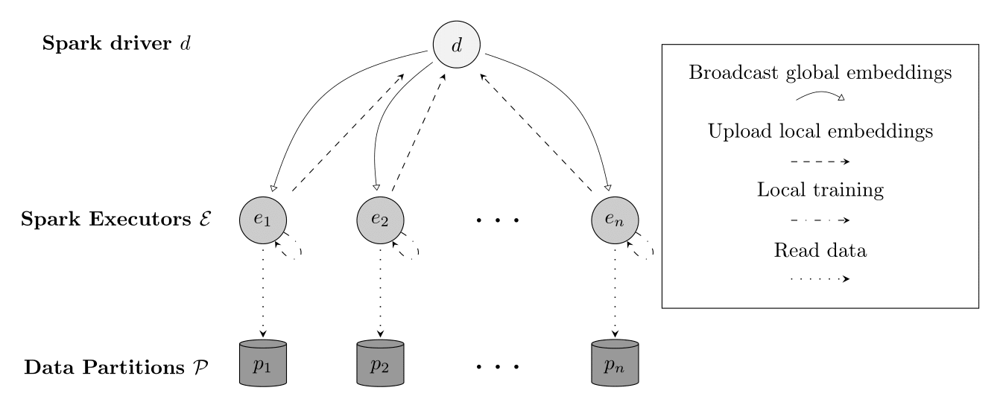
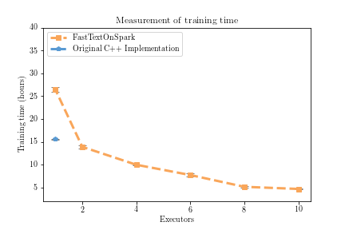
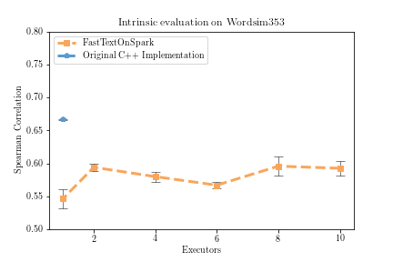

# FastTextOnSpark

FastTextOnSpark brings the FastText algorithm for training word embeddings to Spark clusters. It allows you to utilize clusters for training FastText word embeddings, as compared to the original C++ implementation that is bounded to a single machine.

Currently only supports the skip-gram model and hierarchical softmax output layer.

This package was developed using Spark version 2.2.0 and scala version 2.11.x

## Linking

**Using SBT:**

```
libraryDependencies += "com.github.limmen" % "fasttext_on_spark" % "1.0.0"
```

**Using Maven:**

```xml
<dependency>
    <groupId>com.github.limmen</groupId>
    <artifactId>fasttext_on_spark</artifactId>
    <version>1.0.0</version>
</dependency>
```

### With `spark-shell` or `spark-submit`

This library can also be added to Spark jobs launched through `spark-shell` or `spark-submit` by using the `--packages` command line option.
For example, to include it when starting the spark shell:

```
$ bin/spark-shell --packages TODO
```

Unlike using `--jars`, using `--packages` ensures that this library and its dependencies will be added to the classpath. The `--packages` argument can also be used with `bin/spark-submit`.

## Architecture



## Benchmarks

See results in `./eval/benchmarks.csv`
See commands that were used for benchmarks to reproduce: `./eval/commands.txt`

Get the test dataset [here](https://www.dropbox.com/s/97f1y6ew2mvwhiv/clean_wiki.txt.tar.gz?dl=0).

The dataset were scraped from English wikipedia 2018-03-01 using the scripts provided at
[The FastText repo](https://github.com/facebookresearch/fastText)




## Features

## Examples

### Example project

### Scala API

## Features to Implement In Future Releases

- DataFrame API (ml version instead of mllib)
- CBOW model
- Negative sampling
- Regular softmax
- Cache LOG computations

## Building From Source
This library is built with [SBT](http://www.scala-sbt.org/1.0/docs/Command-Line-Reference.html),
To build a JAR file simply run `sbt package` from the project root.

## Testing
To run the tests, you should run `sbt test`.

## Original FastText References

Cite [1](#enriching-word-vectors-with-subword-information) if using the FastText algorithm for learning word representations.

### Enriching Word Vectors with Subword Information

[1] P. Bojanowski\*, E. Grave\*, A. Joulin, T. Mikolov, [*Enriching Word Vectors with Subword Information*](https://arxiv.org/abs/1607.04606)

```
@article{bojanowski2016enriching,
  title={Enriching Word Vectors with Subword Information},
  author={Bojanowski, Piotr and Grave, Edouard and Joulin, Armand and Mikolov, Tomas},
  journal={arXiv preprint arXiv:1607.04606},
  year={2016}
}
```
## References

If using any of the code in this repsitory in your work or research, please cite: [2](TODO)

In this publication you can also find an evaluation of the system.

### FastTextOnSpark

[2] K.Hammar, [*Deep Text Mining of Instagram Data Without Strong Supervision*](http://kth.diva-portal.org/smash/get/diva2:1222945/FULLTEXT01.pdf)

```
@mastersthesis{Hammar1222945,
   author = {Hammar, Kim},
   institution = {KTH, Software and Computer systems, SCS},
   pages = {90},
   school = {KTH, Software and Computer systems, SCS},
   title = {Deep Text Mining of Instagram Data Without Strong Supervision},
   series = {TRITA-EECS-EX},
   number = {2018:138},
   keywords = {Natural Language Processing, Information Extraction, Machine Learning, Språkteknologi, Informationsextraktion, Maskinlärning},
   abstract = {With the advent of social media, our online feeds increasingly consist of short, informal, and unstructured text. This data can be analyzed for the purpose of improving user recommendations and detecting trends. The grand volume of unstructured text that is available makes the intersection of text processing and machine learning a promising avenue of research. Current methods that use machine learning for text processing are in many cases dependent on annotated training data. However, considering the heterogeneity and variability of social media, obtaining strong supervision for social media data is in practice both difficult and expensive. In light of this limitation, a belief that has put its marks on this thesis is that the study of text mining methods that can be applied without strong supervision is of a higher practical interest. This thesis investigates unsupervised methods for scalable processing of text from social media. Particularly, the thesis targets a classification and extraction task in the fashion domain on the image-sharing platform Instagram. Instagram is one of the largest social media platforms, containing both text and images. Still, research on text processing in social media is to a large extent limited to Twitter data, and little attention has been paid to text mining of Instagram data. The aim of this thesis is to broaden the scope of state-of-the-art methods for information extraction and text classification to the unsupervised setting, working with informal text on Instagram. Its main contributions are (1) an empirical study of text from Instagram; (2) an evaluation of word embeddings for Instagram text; (3) a distributed implementation of the FastText algorithm; (4) a system for fashion attribute extraction in Instagram using word embeddings; and (5) a multi-label clothing classifier for Instagram text, built with deep learning techniques and minimal supervision. The empirical study demonstrates that the text distribution on Instagram exhibits the long-tail phenomenon, that the text is just as noisy as have been reported in studies on Twitter text, and that comment sections are multi-lingual. In experiments with word embeddings for Instagram, the importance of hyperparameter tuning is manifested and a mismatch between pre-trained embeddings and social media is observed. Furthermore, that word embeddings are a useful asset for information extraction is confirmed. Experimental results show that word embeddings beats a baseline that uses Levenshtein distance on the task of extracting fashion attributes from Instagram. The results also show that the distributed implementation of FastText reduces the time it takes to train word embeddings with a factor that scales with the number of machines used for training. Finally, our research demonstrates that weak supervision can be used to train a deep classifier, achieving an F1 score of 0.61 on the task of classifying clothes in Instagram posts based only on the associated text, which is on par with human performance. },
   year = {2018}
}
```

## License

BSD 2-clause, see [LICENSE](./LICENSE)

## Author

Kim Hammar, [kimham@kth.se](mailto:kimham@kth.se)
